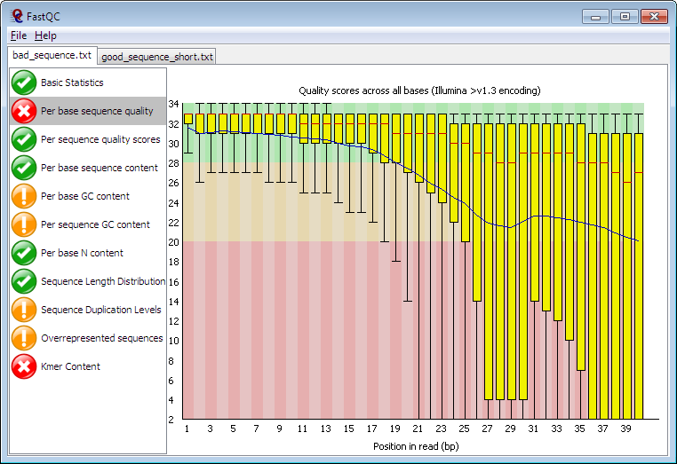

# [Franco](https://github.com/altsplicer) / [***fastqc***]

[](#nolink)

## Overview
This a script used for multi fastqc reports or a single fastqc report for sequencing data.
Fastqc is a QC tool for high throughput sequence data.
For a tutorial see [link](https://hbctraining.github.io/Intro-to-rnaseq-hpc-salmon-flipped/lessons/05_qc_running_fastqc_interactively.html)

## Slurm script headers
UCI uses the SLURM scheduler so you must use slurm headers to specify how and where you want the job to run. 
You must also name the script SCRIPT_NAME.sub and then run the script using "Sbatch SCRIPT_NAME.sub" while your working directory is in location of the script being run. 

For a more in depth view on a SLURM job script headers see https://rcic.uci.edu/slurm/examples.html.

Make note that this script uses the free partition but you can use your free 1000 core hours of the lab's core hours by changing the header.
Otherwise your job can be killed in the free partition.
``` bash
#!/bin/bash
#SBATCH --job-name=fastqc_multiple
#SBATCH -p free
#SBATCH --nodes=1
#SBATCH --mem=100G ## request 100GB of memory
#SBATCH -o /dfs3b/hertel-lab/fcarranz/project_name/fastqc/multifastqc.out ## the name of the output file.
#SBATCH -e /dfs3b/hertel-lab/fcarranz/project_name/fastqc/multifastqc.err ## name of the error file
#SBATCH --mail-user fcarranz@uci.edu
#SBATCH --mail-type=ALL

``` 

## Script multiple QC reports
For a tutorial see https://hbctraining.github.io/Intro-to-rnaseq-hpc-salmon-flipped/lessons/05_qc_running_fastqc_interactively.html
``` bash
#module load the latest fastqc available in UCI's HPC. You type module load fastqc and tab to complete your typing
module load fastqc/0.11.9
#Remember you can always "module avail" to see all the available packages
#module avail
``` 

## Data directory

``` bash
#The directory where the data we want to analyze is located
DATA_DIR=/dfs3b/hertel-lab/fcarranz/project_name/paired_reads/mergedRreads
``` 
## Output directory


``` bash
#The directory where we want the result files to go
QC_OUT_DIR=/dfs3b/hertel-lab/fcarranz/project_name/fastqc_results/fastqc
#Making the result file directory if it isn't already made
#QC_OUT_DIR refers to the name of the directory being made
mkdir -p ${QC_OUT_DIR}
``` 

## Execution
Here we are performing a loop that will use each file in our data directory as input, "*" is a wild card symbol and in this context matches any file in the indicated directory.
Each file will be processed with the program "fastqc", "\" symbol indicates that more options for the program are on the next line.
``` bash
# (--outdir) indicates the output directory for the result files
# $FILE = file name
for FILE in `find ${DATA_DIR} -name \*`; do
    fastqc $FILE \
    --outdir ${QC_OUT_DIR}
done

``` 

## Single file fastqc script

``` bash
fastqc $FILE
	--outdir ${QC_OUT_DIR}
``` 
## Please note if any of these commands are not sent in as a slurm job, but done in the terminal, then you need to be in a interactive node, NOT THE LOGIN NODE! You will get in trouble with UCI's HPC staff. 